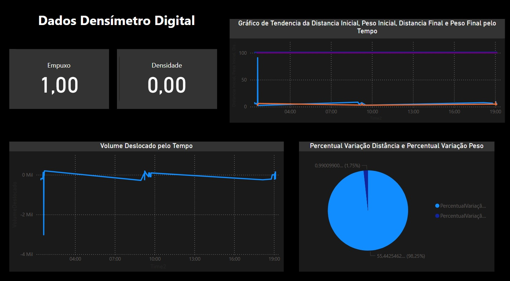

# Datasheet do Densímetro

## Descrição do Projeto
O projeto consiste em um densímetro baseado em um sensor ultrassônico HC-SR04, uma célula de carga strain gauge de 50kg e uma placa amplificadora HX711. O dispositivo mede a densidade de um objeto submerso em um líquido ao calcular a relação entre a massa (medida pela célula de carga) e o volume (calculado pelo sensor ultrassônico).

## Componentes Principais
### 1. Sensor Ultrassônico HC-SR04
- **Descrição:** Utilizado para medir a distância de objetos submersos no líquido.
- **Tensão de Operação:** 5V DC
- **Corrente de Operação:** 15mA
- **Faixa de Medição:** 2cm a 400cm
- **Precisão:** 3mm
- **Interface:** 4 pinos (VCC, Trig, Echo, GND)
- **Portas Utilizadas:** TRIGGER_PIN (17), ECHO_PIN (19)
- **[Datasheet do HC-SR04](https://drive.google.com/drive/folders/1TMXq3geET8TF6RbS5PApKYEYlExPhu4m?usp=sharing)**

### 2. Célula de Carga Strain Gauge de 50kg
- **Descrição:** Utilizada para medir a massa do objeto submerso.
- **Capacidade:** 50kg
- **Material:** Liga de alumínio
- **Precisão:** 0.05% de FS (Full Scale)
- **Interface:** 4 fios (Excitação+, Excitação-, Sinal+, Sinal-)
- **Conexão:** Conectada à placa HX711
- **[Datasheet da célula de carga de 50kg](https://www.datasheethub.com/50kg-half-bridge-load-cell-sensor/)**

### 3. Placa HX711
- **Descrição:** Amplificador de sinal para a célula de carga.
- **Tensão de Operação:** 2.7V a 5V DC
- **Corrente de Operação:** 1.6mA
- **Interface:** 4 pinos (VCC, GND, DT, SCK)
- **Portas Utilizadas:** Conexão aos pinos de ADC do microcontrolador
- **[Datasheet da placa HX711](https://www.digikey.com/htmldatasheets/production/1836471/0/0/1/hx711.html)**

## Especificações do Projeto
- **Tensão de Alimentação:** 5V DC (alimentação dos componentes)
- **Microcontrolador:** BitDogLab
- **Display:** SSD1306 OLED 128x64
- **Conectividade:** Wi-Fi para envio de dados para o ThingSpeak
- **LEDs Indicadores:** RGB para sinalização de status do sistema

## Placa BitDogLab
A placa BitDogLab é um microcontrolador versátil e poderoso baseado no chip RP2040, desenvolvido pela Raspberry Pi Foundation. Ela é ideal para projetos de IoT, automação e outros sistemas embarcados. Alguns dos destaques da placa são:
- **Chip:** RP2040 (Dual-core ARM Cortex-M0+)
- **Memória:** 264KB SRAM, 2MB Flash
- **Conectividade:** Wi-Fi integrado
- **Interfaces:** I2C, SPI, UART, ADC, GPIO
- **Alimentação:** 5V USB ou fonte externa

## Funções e Recursos
1. **Medição de Distância:**
   - Utiliza o sensor HC-SR04 para medir a altura do líquido e calcular o volume submerso.

2. **Medição de Massa:**
   - Utiliza a célula de carga de 50kg e a placa HX711 para medir o peso do objeto.

3. **Cálculo de Densidade:**
   - Baseado na fórmula: Densidade = Empuxo/(Volume deslocado*gravidade)

4. **Interface de Usuário:**
   - Display OLED mostra informações sobre a distância e peso tempo real.

5. **Envio de Dados:**
   - Dados enviados para o ThingSpeak através da conexão Wi-Fi para monitoramento remoto.

6. **Indicadores LED:**
   - LEDs RGB indicam o status de operação:
     - **Verde:** Sistema pronto, pode clicar no botão A para enviar dados.
     - **Vermelho:** Dados estão sendo enviados, não clique no botão A.
     - **Amarelo:** Falha na conexão Wi-Fi.

## Aplicações
Este densímetro pode ser utilizado em:
- Laboratórios
- Indústrias
- Aplicações acadêmicas

## Primeira Tentativa de Dashboard com Dados Fictícios

